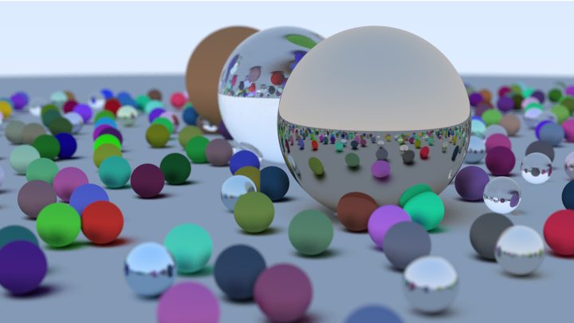

https://raytracing.github.io/books/RayTracingInOneWeekend.html

```sh
sh ./bootstrap.sh
task
```
WIDTH is available as an environment variable to control the size of the generated image.
```sh
WIDTH=1080 task
```

